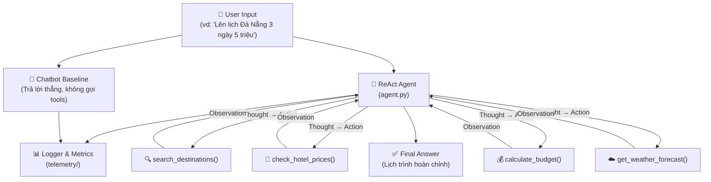

# Kế hoạch triển khai: Travel Planner ReAct Agent
**Đề tài:** Agent Lên Lịch Trình Du Lịch Tự Động  
**Nhóm:** 5 thành viên  
**Tổng điểm mục tiêu:** 100 điểm (60 nhóm + 40 cá nhân)

---

## Tổng quan kiến trúc hệ thống



---

## Phân chia công việc (5 thành viên)

> [!IMPORTANT]
> Mỗi thành viên phải có đóng góp code **riêng, cụ thể** để viết báo cáo cá nhân (40đ).

---

### 👤 Thành viên 1 — Trưởng nhóm / Core Agent Engineer

**Phụ trách:** Implement vòng lặp ReAct chính

**Files cần làm:**
- #### [MODIFY] [agent.py](file:///d:/vinuni/Day-3-Lab-Chatbot-vs-react-agent/src/agent/agent.py)
  - Viết `get_system_prompt()` với few-shot examples rõ ràng về format `Thought/Action/Observation`
  - Implement `run()` loop: gọi LLM → parse `Action` bằng regex → gọi tool → append `Observation` → lặp lại → dừng khi gặp `Final Answer`
  - Implement `_execute_tool()` dispatch theo tên tool
  - Thêm `log_event("TOOL_CALL", ...)` và `log_event("PARSING_ERROR", ...)` vào đúng chỗ


**Điểm nhóm đóng góp:** Chatbot Baseline (2đ) + Agent v1 Working (7đ)

---

### 👤 Thành viên 2 — Tool Developer #1 (Địa điểm & Thời tiết)

**Phụ trách:** Xây dựng data layer và 2 tools đầu

**Files cần làm:**
- #### [NEW] `src/tools/destination_tool.py`
  ```python
  def search_destinations(city: str, travel_style: str) -> str:
      """Tra cứu địa điểm du lịch theo thành phố và phong cách (nghỉ dưỡng/ẩm thực/khám phá)"""
  ```
  Đọc data từ file JSON, lọc và trả về danh sách địa điểm phù hợp.

- #### [NEW] `src/tools/weather_tool.py`
  ```python
  def get_weather_forecast(city: str) -> str:
      """Lấy dự báo thời tiết 3 ngày tới cho thành phố"""
  ```
  Gọi OpenWeatherMap API (free tier, không cần thẻ). Trả về nhiệt độ + mô tả thời tiết.

- #### [NEW] `data/destinations.json`
  Tạo database JSON chứa ít nhất **3 thành phố** (Đà Nẵng, Hà Nội, Hội An), mỗi thành phố có 5-7 địa điểm phân loại theo style.

**Điểm nhóm đóng góp:** Tool Design Evolution (4đ)

---

### 👤 Thành viên 3 — Tool Developer #2 (Khách sạn & Ngân sách)

**Phụ trách:** Xây dựng 2 tools quan trọng nhất để demo logic đa bước

**Files cần làm:**
- #### [NEW] `src/tools/hotel_tool.py`
  ```python
  def check_hotel_prices(city: str, budget_per_night: int) -> str:
      """Tìm khách sạn phù hợp ngân sách mỗi đêm (VND)"""
  ```
  Đọc từ `data/hotels.json`, lọc theo ngân sách và trả về top 3 gợi ý.

- #### [NEW] `src/tools/budget_tool.py`
  ```python
  def calculate_budget(hotel_cost: int, days: int, flight_cost: int, food_daily: int) -> str:
      """Tính toán và kiểm tra tổng ngân sách chuyến đi"""
  ```
  Tính tổng, so sánh với ngân sách user, trả về kết quả chi tiết dạng text.

- #### [NEW] `data/hotels.json`
  Database khách sạn: ít nhất 3 thành phố, mỗi thành phố 5 khách sạn với các mức giá khác nhau.

**Điểm nhóm đóng góp:** Agent v1 Working – thể hiện 2+ tools (7đ)

---

### 👤 Thành viên 4 — Telemetry & Analysis Engineer

**Phụ trách:** Nâng cấp hệ thống monitoring và phân tích dữ liệu

**Files cần làm:**
- #### [MODIFY] [metrics.py](file:///d:/vinuni/Day-3-Lab-Chatbot-vs-react-agent/src/telemetry/metrics.py)
  - Fix `_calculate_cost()` với giá thật của Gemini Flash (0.075$/1M tokens input, 0.30$/1M output)
  - Thêm method `get_summary()` để tổng hợp metrics toàn session (avg latency, total cost, success rate)
  - Thêm method `compare(chatbot_metrics, agent_metrics)` để so sánh 2 hệ thống
- #### [NEW] `src/chatbot/chatbot.py`
  - Viết Chatbot Baseline đơn giản: nhận input → gọi LLM một lần → trả kết quả (không dùng tools)
  - Đây là "đối chứng" để so sánh với Agent
- #### [NEW] `scripts/analyze_logs.py`
  Script đọc file `logs/*.log`, parse JSON từng dòng và tính toán:
  - Tổng số lỗi PARSING_ERROR / HALLUCINATION_ERROR
  - Trung bình số bước (loop count) của Agent
  - So sánh latency: Chatbot vs Agent
  - In ra bảng tổng kết dạng text
- #### [NEW] `scripts/run_benchmark.py`
  Chạy 5-10 câu hỏi test qua cả Chatbot và Agent, tự động ghi metrics.

**Điểm nhóm đóng góp:** Evaluation & Analysis (7đ) + Extra Monitoring Bonus (+3đ)

---

### 👤 Thành viên 5 — Agent V2 & Documentation Lead

**Phụ trách:** Cải thiện agent dựa trên lỗi của v1 và làm toàn bộ báo cáo nhóm

**Files cần làm:**
- #### [NEW] `src/agent/agent_v2.py`
  Dựa trên lỗi đã phát hiện ở v1, cải tiến:
  - **Retry Logic:** Nếu parse Action thất bại lần 1, thử lại với prompt nhắc nhở rõ hơn (tối đa 2 lần)
  - **Guardrail:** Nếu tool trả về "Không tìm thấy", Agent không lặp lại mà gợi ý giải pháp thay thế cho user
  - **Better System Prompt:** Thêm 2-3 few-shot examples cụ thể về du lịch

- #### [NEW] `report/group_report/GROUP_REPORT_[TEAM].md`
  Điền đầy đủ theo template, bao gồm:
  - Flowchart kiến trúc hệ thống (có thể vẽ bằng draw.io hoặc mermaid)
  - Bảng so sánh Chatbot vs Agent v1 vs Agent v2
  - Root Cause Analysis của ít nhất 2 lỗi thực tế

**Điểm nhóm đóng góp:** Agent v2 Improved (7đ) + Flowchart & Insight (5đ) + Failure Handling Bonus (+3đ)

---

## Lịch trình triển khai (3 giai đoạn)

| Giai đoạn | Thời gian | Nội dung | Ai làm |
|:---|:---:|:---|:---|
| **Phase 1: Setup & Foundation** | Ngày 1 | Tạo data JSON, viết Chatbot baseline, setup .env | TV1 + TV2 + TV3 |
| **Phase 2: Core Implementation** | Ngày 1-2 | Implement 4 tools + ReAct loop v1 | TV1 + TV2 + TV3 |
| **Phase 3: Polish & Analysis** | Ngày 2-3 | Chạy benchmark, phân tích lỗi, viết Agent v2, viết báo cáo | TV4 + TV5 |

---

## Cấu trúc file cuối cùng

```
Day-3-Lab-Chatbot-vs-react-agent/
├── src/
│   ├── agent/
│   │   ├── agent.py          ← TV1: ReAct v1
│   │   └── agent_v2.py       ← TV5: ReAct v2 (cải tiến)
│   ├── chatbot/
│   │   └── chatbot.py        ← TV1: Baseline
│   ├── core/                 ← Có sẵn (không sửa)
│   ├── telemetry/
│   │   ├── logger.py         ← Có sẵn
│   │   └── metrics.py        ← TV4: Nâng cấp
│   └── tools/
│       ├── destination_tool.py  ← TV2
│       ├── weather_tool.py      ← TV2
│       ├── hotel_tool.py        ← TV3
│       └── budget_tool.py       ← TV3
├── data/
│   ├── destinations.json     ← TV2
│   └── hotels.json           ← TV3
├── scripts/
│   ├── analyze_logs.py       ← TV4
│   └── run_benchmark.py      ← TV4
├── report/
│   ├── group_report/         ← TV5
│   └── individual_reports/   ← Mỗi người tự làm
└── logs/                     ← Tự động tạo khi chạy
```

---

## Bảng điểm dự kiến

| Hạng mục | Điểm tối đa | Dự kiến |
|:---|:---:|:---:|
| Chatbot Baseline | 2 | 2 |
| Agent v1 (2+ tools) | 7 | 7 |
| Agent v2 (Improved) | 7 | 7 |
| Tool Design Evolution | 4 | 4 |
| Trace Quality | 9 | 8 |
| Evaluation & Analysis | 7 | 7 |
| Flowchart & Insight | 5 | 5 |
| Code Quality | 4 | 4 |
| **Subtotal Base** | **45** | **44** |
| Bonus: Extra Monitoring | +3 | +3 |
| Bonus: Failure Handling | +3 | +3 |
| Bonus: Live Demo | +5 | +5 |
| **Total Group** | **60** | **~55-60** |
| **Individual (mỗi người)** | **40** | **35-40** |
| **🏆 Grand Total** | **100** | **~90-100** |

---

> [!TIP]
> **Mẹo đạt điểm cao nhất:** Điểm **Trace Quality (9đ)** thường bị bỏ qua nhưng rất nhiều điểm. Hãy cố tình tạo ra các lỗi (sai format Action, gọi tool không tồn tại) và ghi lại trace log đầy đủ để phân tích — đây là điểm nhấn quan trọng khi thuyết trình.
