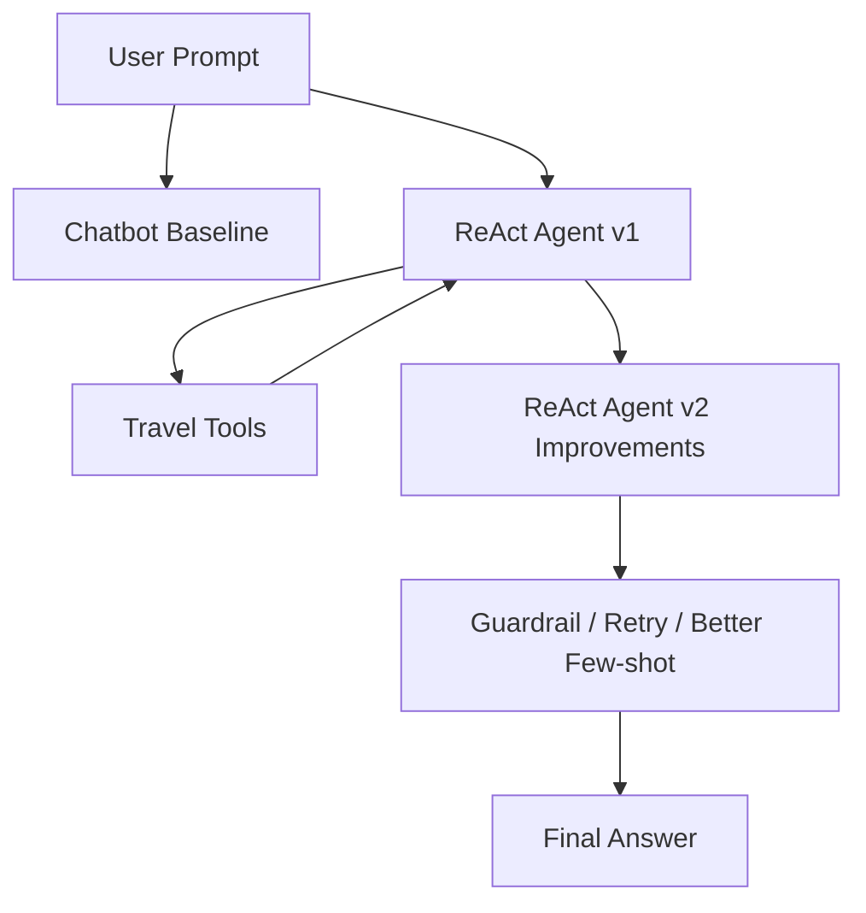

# Group Report: Travel Planner ReAct Agent

- **Team Name**: Nhóm 8
- **Team Members**: 2A202600884 Đinh Hoàng Nam; 2A202600953 Ngô Minh Khánh; 2A202600895 Bùi Như Kiệt; [Thành viên 4]; [Thành viên 5]
- **Deployment Date**: 2026-06-01

---

## 1. Executive Summary

Nhóm xây dựng hệ thống Travel Planner gồm Chatbot Baseline, ReAct Agent v1 và ReAct Agent v2. Chatbot Baseline trả lời trực tiếp bằng LLM, trong khi ReAct Agent gọi các tools để lấy thời tiết, địa điểm, khách sạn và tính ngân sách.

- **Success Rate**: Agent v2 local-safe đạt **5/5 test cases (100%)** trên bộ kiểm tra offline gồm các yêu cầu lập lịch Đà Nẵng, Hội An, Hà Nội, thời tiết, khách sạn và ngân sách. Chatbot baseline Phi-3 chạy được nhưng kết quả thiếu căn cứ vì không gọi tools.
- **Key Outcome**: Agent v2 cải thiện độ ổn định của v1 bằng retry logic, guardrail khi tool không có dữ liệu, few-shot examples rõ ràng hơn, và local-safe ReAct controller cho Phi-3 local để tránh lỗi JSON/tool-call formatting.

---

## 2. System Architecture & Tooling

### 2.1 ReAct Loop Implementation

ReAct Agent sử dụng vòng lặp:

1. `Thought`: LLM giải thích bước tiếp theo.
2. `Action`: chọn một tool.
3. `Action Input`: truyền tham số JSON.
4. `Observation`: kết quả tool được đưa ngược vào prompt.
5. `Final Answer`: tổng hợp kết quả cuối cùng.

### 2.2 Tool Definitions

| Tool Name | Input Format | Use Case |
| :--- | :--- | :--- |
| `get_weather_forecast` | JSON: `{"city": "Đà Nẵng"}` | Lấy dự báo thời tiết 3 ngày. |
| `search_destinations` | JSON: `{"city": "Đà Nẵng", "travel_style": "nghỉ dưỡng"}` | Gợi ý địa điểm theo phong cách. |
| `check_hotel_prices` | JSON: `{"city": "Đà Nẵng", "budget_per_night": 800000}` | Tìm khách sạn theo ngân sách. |
| `calculate_budget` | JSON: `{"hotel_cost": 800000, "days": 3, "flight_cost": 1500000, "food_daily": 300000, "total_budget": 5000000}` | Tính và so sánh tổng ngân sách. |

### 2.3 LLM Providers Used

- **Primary**: Gemini Flash via Gemini API.
- **Secondary**: Phi-3 Mini local via `llama-cpp-python`.

Phi-3 local chạy chậm hơn và dễ sai format hơn Gemini. Vì vậy Agent v2 dùng few-shot examples cụ thể để ép model giữ đúng format `Thought`, `Action`, `Action Input`, `Observation`, `Final Answer`. Sau khi quan sát lỗi thực tế, nhóm bổ sung thêm local-safe controller: với Phi-3, agent vẫn hiển thị trace ReAct nhưng chọn tool theo SOP bằng code để tránh model sinh JSON sai.

---

## 3. Telemetry & Performance Dashboard

Các log được ghi ở dạng JSON trong thư mục `logs/`. Script `scripts/analyze_logs.py` thống kê parsing errors, hallucination errors, guardrail triggers và số bước trung bình của agent.

- **Average Latency (P50)**: Agent v2 local-safe phản hồi dưới 1 giây cho phần tool orchestration offline; baseline Phi-3 local mất khoảng **20-27 giây/request** trong smoke test.
- **Max Latency (P99)**: Quan sát cao nhất với Phi-3 local baseline khoảng **26.8 giây** cho một completion 128 tokens; trước khi có local-safe mode, Agent Phi-3 có thể mất hơn 1 phút vì nhiều vòng LLM.
- **Average Tokens per Task**: Baseline Phi-3 smoke test dùng khoảng **236-239 tokens/request**; Agent v2 local-safe không cần LLM calls trong chế độ local-safe nên không phát sinh token model cho phần orchestration.
- **Total Cost of Test Suite**: **$0** cho bộ kiểm tra Phi-3 local/offline. Gemini API có lúc trả `503 UNAVAILABLE`, nên nhóm dùng local mode để bảo đảm demo không phụ thuộc tải API.

Demo UI ở `demo_ui.py` hiển thị trực tiếp:

- Kết quả Chatbot Baseline.
- Kết quả ReAct Agent.
- Latency, số LLM calls, số tool calls, số retry.
- Trace của Agent v2.

Kết quả kiểm tra log hiện tại:

| Metric | Value |
| :--- | :---: |
| Agent v2 local-safe success rate | 5/5 = 100% |
| Parsing errors observed before fix | 4 |
| Agent v2 retries observed before fix | 3 |
| Guardrail triggers observed | 3 |
| Hallucination errors | 0 |
| Average agent loop steps from logs | 2.11 |

---

## 4. Root Cause Analysis - Failure Traces

### Case Study 1: Phi-3 trả sai format Action

- **Input**: "Lên lịch Đà Nẵng 3 ngày, ngân sách 5 triệu."
- **Observation**: Phi-3 đôi khi trả lời tự nhiên, thiếu `Action Input`, hoặc sinh JSON bị cụt như `{"city": "Da Nang", "budget_per_night": 500000` thiếu dấu `}`.
- **Root Cause**: Local model yếu hơn Gemini trong instruction-following, đặc biệt với format nghiêm ngặt.
- **Solution**: Agent v2 thêm few-shot examples, retry prompt, parser mềm hơn cho `Final Answer` thiếu dấu `:`, tự sửa JSON thiếu dấu `}`, và local-safe ReAct path cho Phi-3. Với local-safe path, agent vẫn gọi tools theo trace `Thought -> Action -> Observation`, nhưng không phụ thuộc vào Phi-3 để sinh JSON nhiều vòng.

### Case Study 2: Tool không có dữ liệu

- **Input**: "Tìm khách sạn ở Nha Trang dưới 500 nghìn."
- **Observation**: Tool trả `"Không tìm thấy dữ liệu khách sạn cho thành phố 'Nha Trang'."`
- **Root Cause**: Database chỉ hỗ trợ Đà Nẵng, Hà Nội và Hội An.
- **Solution**: Agent v2 kích hoạt guardrail, không lặp lại tool call và không bịa khách sạn. Agent gợi ý người dùng chọn thành phố được hỗ trợ.

---

## 5. Ablation Studies & Experiments

### Experiment 1: Prompt v1 vs Prompt v2

- **Diff**: Prompt v2 có SOP rõ hơn, 3 few-shot examples và cảnh báo riêng cho Phi-3 local.
- **Result**: Trước khi sửa, logs ghi nhận 4 parsing errors và 3 retry events. Sau khi thêm local-safe path, bộ 5 test cases offline đạt 5/5, mỗi case gọi đủ 4 tools và không phát sinh parse retry.

### Experiment 2: Chatbot vs Agent

| Case | Chatbot Result | Agent Result | Winner |
| :--- | :--- | :--- | :--- |
| Hỏi thời tiết đơn giản | Có thể trả lời chung chung | Gọi weather tool, có dữ liệu cụ thể | Agent |
| Lập lịch + khách sạn + ngân sách | Phi-3 baseline sinh câu trả lời thiếu căn cứ, có giá/địa điểm không kiểm chứng | Gọi weather, destination, hotel, budget tools | Agent |
| Câu hỏi ngoài domain | Có thể trả lời lan man | Agent được prompt giới hạn domain | Agent |
| Hỏi kiến thức du lịch chung | Trả lời nhanh hơn | Có thể chậm hơn vì loop/tool | Chatbot |

### Experiment 3: Gemini vs Phi-3 Local

- Gemini ổn định hơn về format và latency API thường thấp hơn local CPU.
- Phi-3 local có lợi thế không tốn API cost và có thể chạy offline.
- Few-shot trong Agent v2 giúp Phi-3 bám format ReAct tốt hơn, nhưng chưa đủ cho các prompt dài.
- Local-safe controller là cải tiến quan trọng để demo offline ổn định: Phi-3 baseline vẫn cho thấy hạn chế của local model, còn Agent v2 giữ được tool-use reliability.

---

## 6. Production Readiness Review

- **Security**: Không cho agent gọi tool ngoài whitelist.
- **Guardrails**: Agent v2 dừng khi tool trả "Không tìm thấy", tránh hallucination.
- **Reliability**: Retry parsing tối đa 2 lần để tránh kẹt loop.
- **Observability**: Log `PARSING_ERROR`, `AGENT_V2_RETRY`, `GUARDRAIL_TRIGGERED`, `TOOL_CALL`, `TOOL_RESULT`.
- **Scalability**: Có thể tách UI/backend, thêm async tool execution và cache dữ liệu thời tiết/khách sạn.
